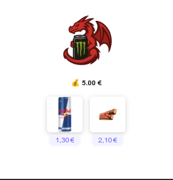

# 🐉 ADHDragon

## 📖 Description
ADHDragon est une extension Chrome pensée pour les personnes avec TDAH. Elle propose un dragon virtuel qui t’accompagne et t’aide à rester concentré, avec des interactions ludiques (nourrir, donner à boire…).

## 🚀 Fonctionnalités
- [x] Affichage d’un dragon virtuel dans la popup
- [x] Système de monnaie virtuelle
- [x] Boutons pour nourrir ou donner à boire au dragon (Twix, Redbull)
- [x] Message si manque d'argents
- [ ] Système pour gagner de la monnaie virtuelle

## 🛠️ Technologies utilisées
- **Front-end** : HTML, CSS, JavaScript
- **Plateforme** : Extension Chrome (manifest v3)

## 📂 Structure du projet

```bash
adhdragon/
│── icon/           # Icônes du projet
│── img/            # Images des objets (Redbull, Twix…)
│── popup/
│   ├── popup.html
│   ├── style.css
│   └── dragon.js   # Logique de la popup
│── background.js   # Script de fond (gains automatiques)
│── manifest.json   # Configuration de l’extension
│── README.md       # Documentation principale
```

## ⚙️ Installation & utilisation

### 1. Cloner le projet

```bash
git clone https://github.com/MarineG404/ADHDragon
cd adhdragon
```

### 2. Installer l’extension dans Chrome

1. Ouvre Chrome et va dans **Menu > Extensions**.
2. Active le **mode développeur**.
3. Clique sur **Charger l’extension non empaquetée**.
4. Sélectionne le dossier du projet.

### 3. Utilisation

- Clique sur l’icône ADHDragon dans la barre d’extensions.
- Gère ta monnaie virtuelle et interagis avec le dragon via la popup.

## 📸 Captures d’écran



## 👥 Auteur

- Marine GONNORD - Développement & design
